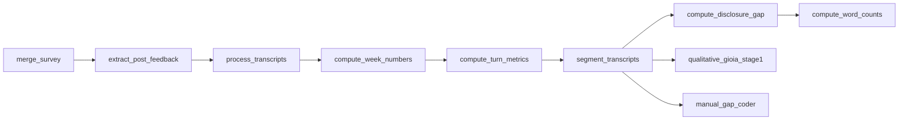

# Saatkamp Thesis - Transcript Analysis Code

Python tooling for enriching AI check-in transcripts (segmentation, disclosure gap,
manual coding, Gioia Stage 1).

## Layout

| Path | Contents |
|------|----------|
| `data/` | Excel workbooks (transcripts + survey) |
| `scripts/` | All Python entry points and helpers |
| `prompts/` | Anthropic prompt templates |
| `config/` | Topic / Likert JSON mappings |
| `docs/` | Feature READMEs (manual coder, Gioia) |
| `env/` | `.env.example` for API keys |
| `run_full_pipeline.sh` | Automated batch run (steps 1–8 below) |

## Setup

Requires **Python 3.9+**.

```bash
pip install -r requirements.txt
cp env/.env.example env/.env   # then set ANTHROPIC_API_KEY
```

API key locations (first match wins):

1. `env/.env` (recommended)
2. `.env` in the project root

Optional variables: `ANTHROPIC_MODEL`, `ANTHROPIC_MAX_TOKENS`, `ANTHROPIC_SLEEP_SEC`.

This project uses **Anthropic only** (Claude). There is no OpenAI/GPT integration and no `OPENAI_API_KEY` is required.

**Close Excel** before running any script that writes a workbook.

### API keys and GitHub

- Keys are read from environment files only — **never hardcoded in Python**.
- Put your real key in `env/.env` (copy from `env/.env.example`) or in a project-root `.env`.
- If a real key was ever committed, **revoke it in the Anthropic console** and create a new one.

## Data preparation requirement

Before running any script, fill **all columns marked in grey** in both Excel files in `data/`:

- `data/Master-Supabase Transcripts.xlsx`
- `data/Master-Supabase Survey Results.xlsx`

The grey-marked fields must be populated with data from the **Sona8 Platform Database** connected to **ElevenLabs**.

The transcript data sheet is resolved automatically (`Database Sessions`, or the first sheet whose name contains `transcript`, or `TRANSCRIPTS_SHEET_NAME` env var).

## Pipeline overview

Scripts run in dependency order. Most steps only **fill empty cells** by default; pass `--all-rows` to recompute and overwrite.



| # | Script | What it computes | Main output columns |
|---|--------|------------------|---------------------|
| 1 | `merge_survey_to_transcripts.py` | Joins pre/post survey rows to transcript sessions by `session_id` | `pre-survey_response_json`, `pre-survey_submitted_at`, `post-survey_response_json`, `post-survey_submitted_at` |
| 2 | `extract_post_feedback_topic.py` | Extracts open-ended post-survey comment | `post_feedback_topic` |
| 3 | `process_transcripts.py` | Builds participant-only text; numbers sessions per employee | `participant_text_clean`, `session_number_per_employee` |
| 4 | `compute_week_numbers.py` | Employee session index and audit calendar week | `week_number`, `audit_week` |
| 5 | `compute_turn_metrics.py` | Turn count and response-length metrics | `participant_turn_count`, `avg_words_per_turn`, `longest_response_words` |
| 6 | `segment_transcripts_anthropic.py` | LLM topic segmentation of full interview JSON | `text_overall_experience`, `text_client_value`, `text_workload_sustainability`, `text_leadership_engagement`, `text_closing`, `text_additional_topic` |
| 7 | `compute_disclosure_gap_anthropic.py` | LLM disclosure-gap coding (pre-survey vs. speech) | `Disclosure gap`, `gap_*`, `reason_*` per topic |
| 8 | `compute_word_counts.py` | Total and per-topic word counts | `word_count_total`, `word_count_overall`, … |
| — | `segment_transcripts_anthropic.py --refresh-negative-issue` | Recomputes keyword-based negative-issue flags (no API) | `negative_issue_keyword_count`, `negative_issue_auto` |

**Not in `run_full_pipeline.sh`** (run manually after step 6):

| Script | What it does | Output |
|--------|--------------|--------|
| `qualitative_gioia_stage1.py` | LLM quote extraction + first-order Gioia codes | `Qualitative Analysis` sheet |
| `manual_gap_coder.py` | Browser UI for Reviewer 1 | `manual_gap_*`, `gap_segmentation_*`, `negative_issue_*` |
| `manual_gap_coder_reviewer2.py` | Browser UI for Reviewer 2 | `*_2` reviewer columns |

Support modules (not run directly): `workbook_utils.py`, `manual_gap_core.py`, `manual_gap_core_reviewer2.py`, `qualitative_gioia_core.py`.

## Full pipeline

From the project root:

```bash
./run_full_pipeline.sh
```

This runs steps 1–8 in order, then `--refresh-negative-issue`. To test segmentation on a subset without processing every row:

```bash
SEGMENT_EXTRA="--limit 2" ./run_full_pipeline.sh
```

## Running individual scripts

All commands assume the project root as working directory:

```bash
python3 scripts/merge_survey_to_transcripts.py
python3 scripts/extract_post_feedback_topic.py
python3 scripts/process_transcripts.py
python3 scripts/compute_week_numbers.py
python3 scripts/compute_turn_metrics.py
python3 scripts/segment_transcripts_anthropic.py
python3 scripts/compute_disclosure_gap_anthropic.py
python3 scripts/compute_word_counts.py
```

### Common flags

| Flag | Effect |
|------|--------|
| *(default)* | Only write cells that are still empty |
| `--all-rows` | Recompute and overwrite all target cells for eligible rows |
| `--limit N` | Process at most N eligible rows (Anthropic scripts, Gioia) |
| `--dry-run` | Print what would run without calling the API or saving |

Examples:

```bash
python3 scripts/segment_transcripts_anthropic.py --limit 3
python3 scripts/compute_disclosure_gap_anthropic.py --dry-run
python3 scripts/process_transcripts.py --all-rows
```

Anthropic scripts require a valid `ANTHROPIC_API_KEY`. Use `--limit` or `--dry-run` first to control API cost during testing.

## Manual gap coding

```bash
streamlit run scripts/manual_gap_coder.py
streamlit run scripts/manual_gap_coder_reviewer2.py
```

See `docs/README_MANUAL_GAP_CODER.md`.

## Gioia Stage 1

Run **after** topic segmentation (`segment_transcripts_anthropic.py`) has populated the `text_*` columns:

```bash
python3 scripts/qualitative_gioia_stage1.py
python3 scripts/qualitative_gioia_stage1.py --limit 3    # test
python3 scripts/qualitative_gioia_stage1.py --all-rows   # re-run eligible sessions
```

By default, sessions already present in `Qualitative Analysis` are skipped. See `docs/README_QUALITATIVE_GIOIA.md`.

## Troubleshooting

| Issue | Fix |
|-------|-----|
| `Permission denied` / file locked | Close Microsoft Excel (and any app using the workbook) |
| `ModuleNotFoundError: streamlit` | `pip install -r requirements.txt` |
| Anthropic script exits immediately with 0 rows | Target cells may already be filled; use `--all-rows` or check `--dry-run` output |
| Gioia processes 0 sessions | Topic `text_*` columns empty (run segmentation first), or sessions already in `Qualitative Analysis` (use `--all-rows`) |
| Wrong sheet updated | Set `TRANSCRIPTS_SHEET_NAME` to the exact sheet name in your workbook |
| Slow `pip install` | `requirements.txt` includes some packages not used by current scripts; a minimal install is `pandas openpyxl anthropic python-dotenv streamlit` |

## Further reading

- `docs/README_MANUAL_GAP_CODER.md` - manual severity / negative-issue coding UI
- `docs/README_QUALITATIVE_GIOIA.md` - Gioia Stage 1 output columns and re-run behaviour
- `env/README.txt` - API key file locations

